# INF4067 – UML et Design Patterns

## Evaluation pratique : Etude de cas

### Application de vente de véhicules en ligne

<details>
<summary>

## Description

</summary>

Nous prenons donc l’exemple de la conception d’un système pour illustrer la mise en œuvre
de ces patrons. Le système à concevoir est une application web de vente en ligne des véhicules
comme, par exemple, des automobiles ou des scooters. Ce système autorise différentes
opérations comme l’affichage d’un catalogue, la prise de commande, la gestion et le suivi de
la clientèle. De plus, il est également accessible sous forme d’un service web.
Le site permet d’afficher un catalogue de véhicules proposés à la vente, d’effectuer des
recherches au sein de ce catalogue, de passer la commande d’un véhicule, de choisir des
options pour celui-ci avec un système de chariot virtuel. Les options incompatibles entre elles
doivent également être gérées (par exemple "sièges sportifs" et "sièges en cuir “ sont des
options incompatibles). Il est également possible de revenir à un état précédent du chariot.
Le système doit gérer les commandes. Il doit être capable de calculer les taxes en fonction du
pays de livraison du véhicule. Il doit également gérer les commandes payées au comptant et
celles assorties d’une demande de crédit. Il prend en compte les demandes de crédit. Le
système gère les états de la commande : en cours, validée et livrée.
Lors de la commande d’un véhicule, le système construit la liasse des documents nécessaires
comme la demande d’immatriculation, le certificat de cession et le bon de commande. Ces
documents sont disponibles au format PDF ou au format HTML.
Le système permet également de solder les véhicules difficiles à vendre, à savoir ceux qui sont
dans le stock depuis longtemps.
Il permet également une gestion des clients, en particulier des sociétés possédant des filiales
afin de leur proposer, par exemple, l’achat d’une flotte de véhicules.
Lors de la visualisation du catalogue, il est possible de visualiser des animations associées à un
véhicule. Le catalogue peut être présenté avec un ou trois véhicules par ligne.
La recherche dans le catalogue peut s’effectuer à l’aide de mots clés et d’opérateurs logiques
(et, ou).
Il est possible d’accéder au système via une interface web classique ou au travers d’un système
de web services.

</details>

<details>
<summary>

## Project Description

</summary>

ce repository contient le backend pour une application de vente de vehicule en ligne fait en Java spring boot et basée sur les patrons de conception Abstract Factory,Builder,Factory Method,Singleton,Adapter,Bridge,Composite,Decorator,Observer,Iterator,Template Method, il contient plusieurs dossiers notamment

- models: ce dossier contient les entités de l'application

- repository: c'est dossier est constitué des interfaces par defaut utilisant le JPARepository qui contient des methodes par defaut pour interagir avec la base de données.

- controller: ces dossier contient les differents classes qui implementent routes de l'application.

- service: ce dossier contient les classes concretes pour l'implementation des fonctionnalités des entites. Il est constitué d'un sous dossier:
  -> implementation: qui est constitué des interfaces ou classes abstraites  qui contiendront les signatures des methodes en fonction des patrons à implementer, tout en respectant leurs modeles

</details>

<details>
<summary>

## Installation

</summary>

1. Clone the project:

    ```bash
    git clone https://github.com/Prune12/CAR_APP.git
    ```

2. Import the project into your IDE.

3. Install dependencies:

    ```bash
    mvn install
    ```

4. Run the project:

    ```bash
    mvn spring-boot:run
    ```


</details>

<details>

<summary>

## Patron de conception

</summary>

### 1. Abstract Factory

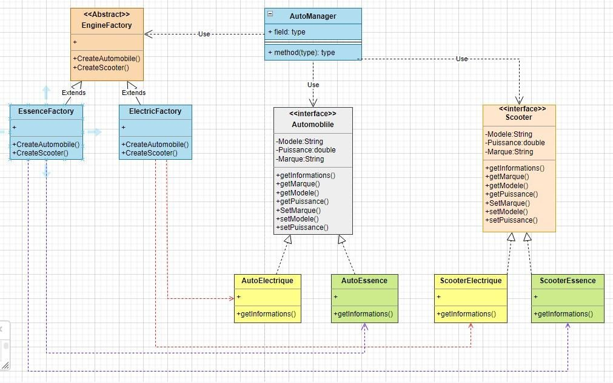

### 2. Builder

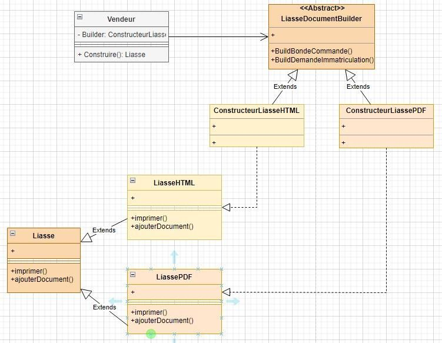

### 3. Factory Method

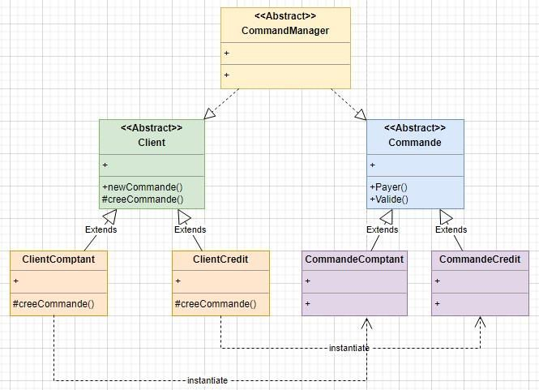

### 4. Singleton

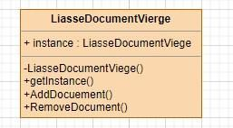

### 5. Adapter

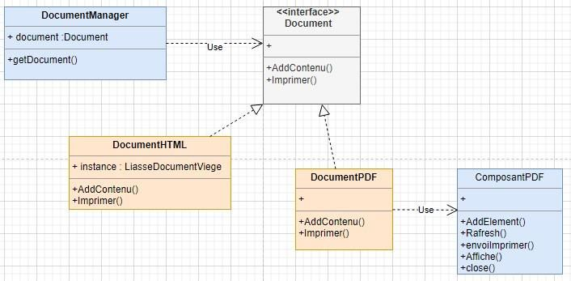

### 6. Bridge

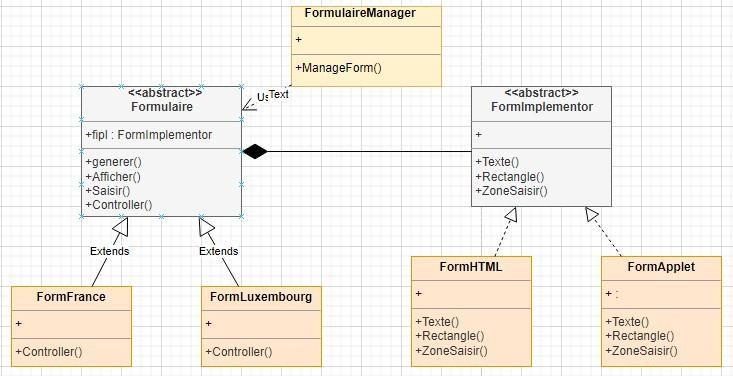

### 7. Composite

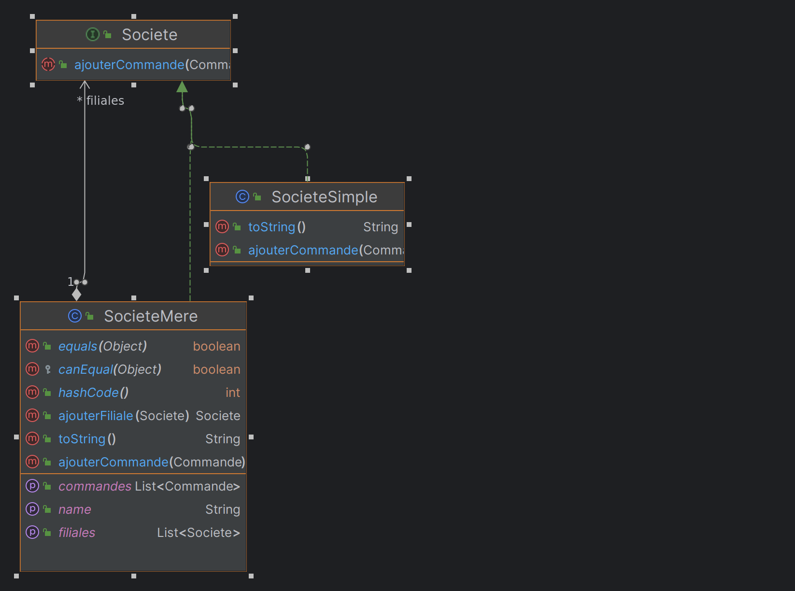

### 8. Decorator

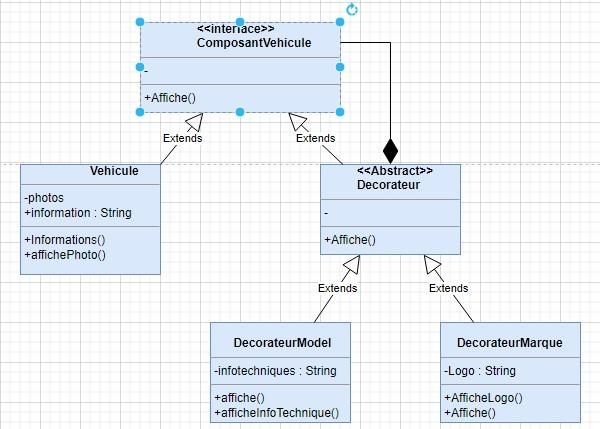

### Observer

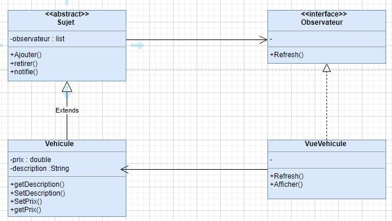

### 9. Iterator

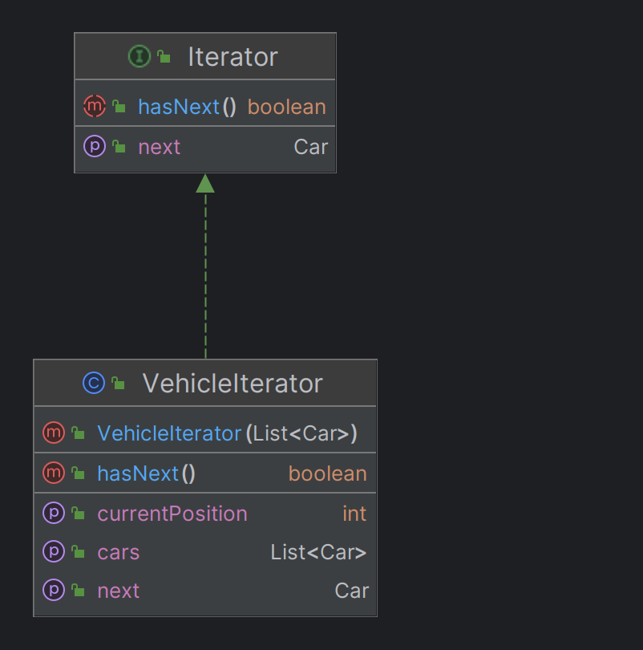

### 10. Template Method

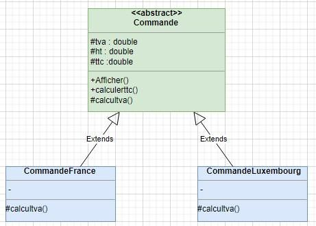
</details>


<details>

<summary>

## Technologies

</summary>

- Java
- Spring Boot
- Maven
- MariaDB
- JPA
- Hibernate
- Lombok

</details>